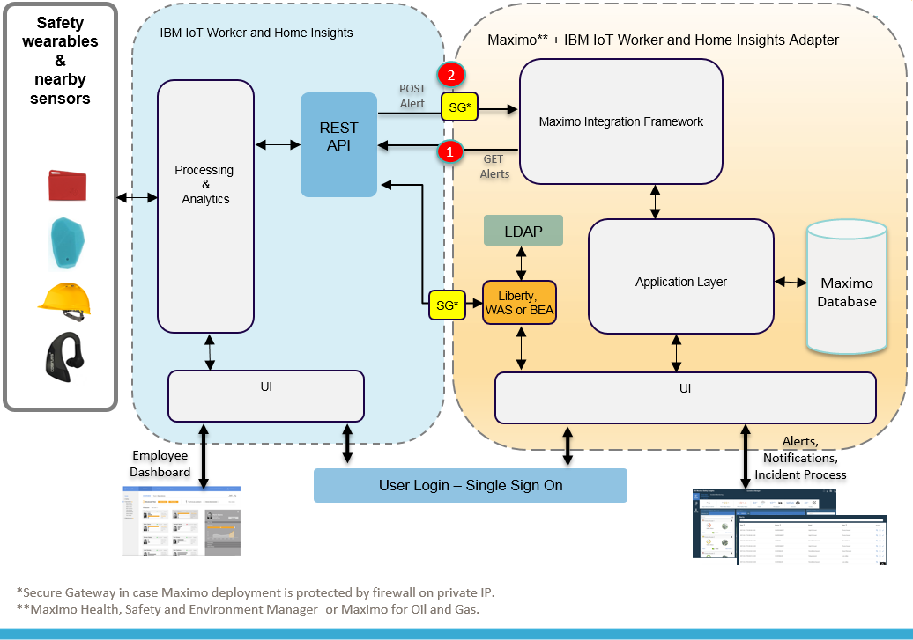
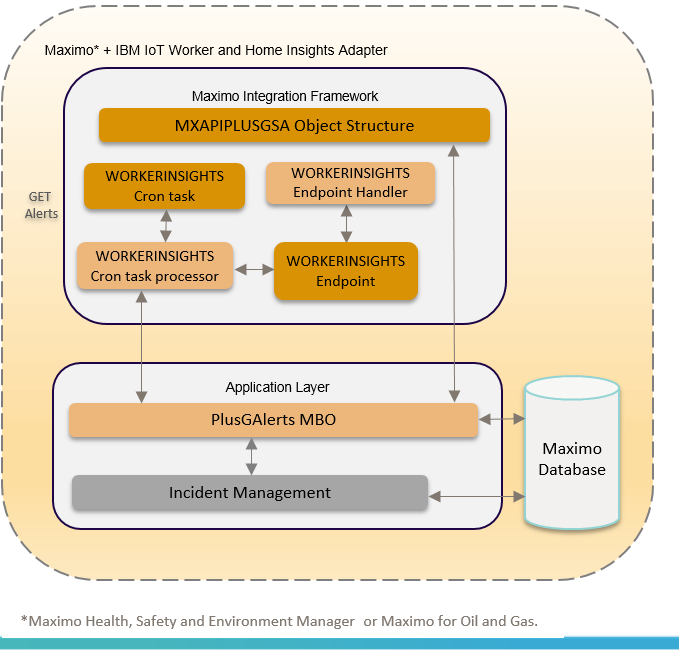
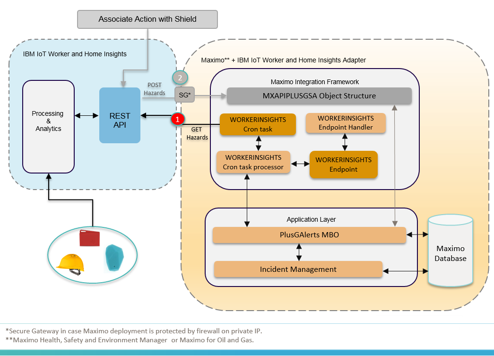
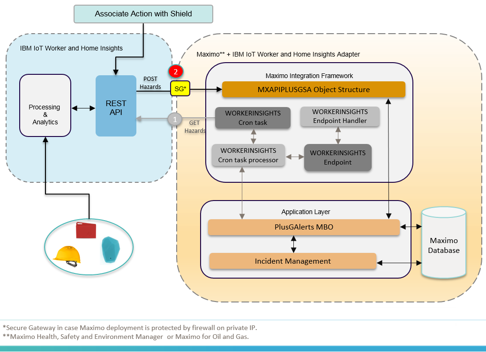
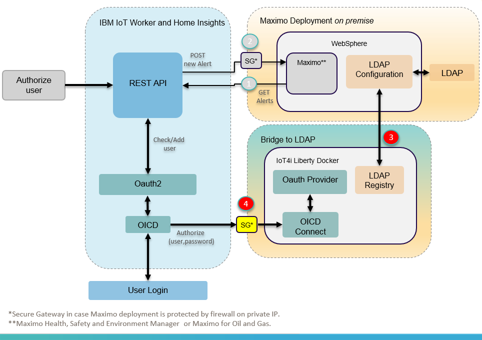
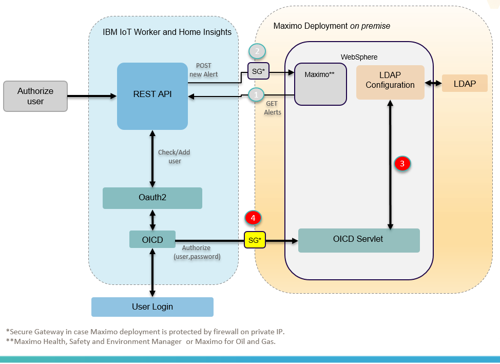

# *IBM IoT Worker and Home Insights Adapter for IBM Maximo for Oil and Gas and Gas and IBM Maximo Health, Safety and Environment Manager*

## Overview
[IBM IoT Worker and Home Insights](https://www-01.ibm.com/common/ssi/cgi-bin/ssialias?infotype=AN&subtype=CA&htmlfid=897/ENUS218-258&appname=USN), which was formerly known as IBM IoT for Insurance on Cloud, is a fully-managed cloud service offering that collects and analyzes data from sensors, such as wearables devices, to detect risks that are related to the employee work environment. It can detect falls, fatigue, heat exposure, and many others potenial hazards.

In this context, after a potential hazard is detected by IoT Worker and Home Insights, [IBM Maximo Health, Safety and Environment Manager](https://www.ibm.com/support/knowledgecenter/en/SS5GME_7.6.1/com.ibm.hse.doc/pdf_hse_qsg.html) / [IBM Maximo for Oil and Gas](https://www.ibm.com/support/knowledgecenter/en/SSLL9G_7.6.0/com.ibm.oil.doc/pdf_oil_qsg.html) is able to handle and address this hazard by starting the Incident Management process.

The following component diagram shows an example of integration architecture between Maximo products and IBM IoT Worker and Home Insights. Two ways of integration are supported:

1. Maximo products can use a crontask that is configured to pull the hazards from IoT Worker and Home Insights and persist each hazard as an alert in the Maximo product.

2. IoT Worker and Home Insights can use actions that are configured to push hazards to Maximo products as an alert every time a new hazard is detected by a shield.

Figure 1 - Maximo products and IoT Worker and Home Insights overall integration architecture.

The option for one of these ways of integration depends on the use case and criticality of the hazards. The following items describe [how to set up the overall environment](#1-how-to-set-up--maximo-health-safety-and-environment-manager-or-maximo-for-oil-and-gas-with-the-adapter-for-iot-worker-and-home-insights) and then how to configure option [#1](#2--configuring-the-maximo-product-to-get-hazards-from-iot-worker-and-home-insights) and [#2](#3-configuring-iot-worker-and-home-insights-to-post-hazards-to-the-maximo-product) described above.

If Maximo Health, Safety and Environment Manager or Maximo for Oil and Gas is installed with LDAP, it is possible to configure the single sign on between the Maximo product and IoT Worker and Home Insights.  See [item 4](#4-the-maximo-product-and-iot-worker-and-home-insights-ldap-configuration-for-single-sign-on) for more details.

## 1. How to set up  Maximo Health, Safety and Environment Manager or Maximo for Oil and Gas with the adapter for IoT Worker and Home Insights

## 1.1. Prerequisites

 * A tenant at [IoT Worker and Home Insights](https://www-01.ibm.com/common/ssi/cgi-bin/ssialias?infotype=AN&subtype=CA&htmlfid=897/ENUS218-258&appname=USN) with an access token.

* Maximo configuration that is required:

    * [Maximo Asset Management Tivoli's process automation engine version 7.6.1](https://www.ibm.com/support/knowledgecenter/en/SSLKT6_7.6.0/com.ibm.mam.doc/welcome.html) or later (versions later than 7.6.0  might be allowed but were not tested) using LDAP Basic authentication for single sign on (see [configuration here](https://www.ibm.com/developerworks/community/blogs/a9ba1efe-b731-4317-9724-a181d6155e3a/entry/maximo_and_ldap_configuration_from_start_to_finish?lang=en_us)).
    * [Maximo for Oil and Gas version 7.6.1](https://www.ibm.com/support/knowledgecenter/SSLL9G_7.6.1/com.ibm.oil.doc/welcome.html) or [Maximo Health, Safety and Environment Manager version 7.6.1](https://www.ibm.com/support/knowledgecenter/en/SS5GME_7.6.1/com.ibm.hse.doc/pdf_hse_qsg.html)

    *i. If you opt to compile the source code, you need to configure the Maximo development environment to run Java™ Platform, Standard Edition Development Kit ([jdk 8](https://developer.ibm.com/javasdk/downloads/)) with the content listed previously.*

    *Instructions for how to set up the Maximo development environment can be found at [Set up your environment for Maximo Asset Management](https://developer.ibm.com/assetmanagement/develop/setup/).* 

    *ii. If you opt to download the binary zip, you only need to have the required Maximo configuration deployed in an application server (Liberty, Websphere or Weblogic).*

* [Secure Gateway](https://www.ibm.com/cloud/secure-gateway) configured in case the Maximo product is running on a private IP and you opt by configuring actions to push alerts from IoT Worker and Home Insights into the Maximo product. The Secure Gateway will establish a secure connection between IoT Worker and Home Insights running on IBM Cloud and the Maximo product on the private IP.

## 1.2. Getting started

[IBM IoT Worker and Home Insights Adapter](.) is an add-on that is installed on the top of Maximo for Oil and Gas or Maximo Health, Safety and Environment Manager. The following figure shows the main components of the adapter: 

Figure 2 - Main components of the adapter for IoT Worker and Home Insights.

It contains database scripts and Java code to create and enable the following records and features:

* The WORKERINSIGHTS endpoint to IoT Worker and Home Insights tenant. This endpoint has its own [http  handler](./Source/applications/maximo/businessobjects/src/psdi/plusg/app/plusgalert/PlusGWorkerInsightsHandler.java) implemented to authenticate and invoke data from the IoT Worker and Home Insights tenant.
* The WORKERINSIGHTS cron task to get the hazards from IoT Worker and Home Insights, which, by default, is configured to get new hazards every five minutes. The [cron task properties](#configure-and-enable-the-maximo-cron-task) can be used to configure which kinds of hazards will be persisted as alerts and which will create incidents. A [process class](./Source/applications/maximo/businessobjects/src/psdi/plusg/app/plusgalert/PlusGWorkerInsightsProcessor.java) is associated with this cron task to copy the hazards from IoT Worker and Home Insights into alerts in the Maximo product. This [process class](./Source/applications/maximo/businessobjects/src/psdi/plusg/app/plusgalert/PlusGWorkerInsightsProcessor.java) can be altered if it is necessary to change the mapping between hazard and alert attributes (see method syncAlertsReadings).
* A new Maximo business object [PlusGAlerts](./Source/applications/maximo/businessobjects/src/psdi/plusg/app/plusgalert/PlusGAlerts.java) to handle the PLUSGALERTS object. This class generates the incident records so it can be altered to change the mapping between alerts and incidents in the Maximo product.
* A new object structure, MXAPIPLUSGSA, to expose PLUSGALERTS object and make it possible for IoT Worker  and Home Insights to directly push hazards into the Maximo product as alerts.
* New attribute alertid in the INCIDENTS object to make the relationship between INCIDENTS and PLUSGALERTS after an incident is created triggered by an alert.
* The [product XML](./Source/applications/maximo/properties/product/workerinsights.xml) file to identify the adapter for IoT Worker and Home Insights as an extention or add-on.

## 1.3. Install the adapter for IoT Worker and Home Insights as an add-on

After the development environment is configured according item 1.1:

### Get code from GitHub

* *Clone or fork [IBM IoT Worker and Home Insights Adapter](.) from GitHub*
* If you opt to use the source code:
    * *Copy the content of the [maximo-workerInsights/source](./Source) package over the  Maximo installation folder (MAXIMO_HOME)*
    * Build the entire project and make sure the [maximo-workerInsights/source](./Source) generated the "*.class" output. [See instruction here - Building and compiling section](https://developer.ibm.com/assetmanagement/develop/setup/).

* If you opt to use the binary code:
    * *Copy and unzip the content of the [maximo-workerInsights/binary](./binary) package over the Maximo installation folder (MAXIMO_HOME)*

### Run updatedb
*[See instruction here on how to run Updatedb.](https://developer.ibm.com/static/site-id/155/maximodev/toolsguide/TOOLS.html#_updatedb)*

### Build and deploy the EAR file
*[See instruction here on how to build and deploy EAR files.](https://www.ibm.com/support/knowledgecenter/en/SSLKT6_7.6.0.7/com.ibm.mbs.doc/fm_sag/configsys/t_ctr_config_basic_sys.html)*
After the EAR file is succesfully deployed, start the Maximo application server and check if the workerInsights add-on is successfully installed by looking at Help -> System Properties. Check if there is a new line for the adapter:

IBM IoT Worker and Home Insights Adapter 7.6.0.0 Build 20180920-104000 DB Build V7600-03

## 2.  Configuring the Maximo product to get hazards from IoT Worker and Home Insights

The following figure shows the schema for the first option of integration (bullet 1 identified in the figure):

Figure 3 - Architecture for the Maximo product to get hazards from IoT Worker and Home Insights.

In this case, a cron task is created to pull hazards from IoT Worker and Home Insights every five minutes, although the time interval is configurable, and persist these hazards as an alert record in the Maximo PLUSGALERT object. Note that it is not a real-time process, because  it needs to wait for the cron task to get the alerts.

### Configure Maximo endpoint
Go to Maximo End Points application and open the WORKERINSIGHTS record. 

* *Specify the property URL by using the IoT Worker and Home Insights endpoint API to GET hazards.*
* *Specify AUTHTOKEN by using the token for your tenant, which is provided by IoT Worker and Home Insights.*

### Configure and enable the Maximo cron task

Go to the Maximo Cron Task Setup application and open the WORKERINSIGHTS record.

* The parameter ALLOWED_ALERT has a list of hazard types that are persisted as an alert in the Maximo PLUSGALERTS object. Keep the format of the list separated by commas.
* The parameter ALERT_TO_INCIDENT has a list of hazard types that trigger an incident in the Maximo INCIDENT view. Keep the format of the list separated by commas.
* The parameter INIT_TIME configures the initial time that the cron task gets the hazards. Keep the format of this date as the default example.
* The WORKERINSIGHTS cron task instance is scheduled to run the cron task every five minutes. This value can be changed according the need of the use case.
* To activate the WORKERINSIGHTS cron task instance, click on the ACTIVE check box and exit the application. After the schedule interval minutes, which by default is five minutes, open the WORKERINSIGHTS cron task record and check the History tab to see whether the cronvtask ran successfully. 

## 3. Configuring IoT Worker and Home Insights to post hazards to the Maximo product

The following figure shows the schema for the second option of integration (bullet 2 identified in the figure). It is the recommended configuration for any critical hazards that need to be addressed urgently.

If the Maximo product is running on a private IP, you must configure [Secure Gateway](https://www.ibm.com/cloud/secure-gateway).

Figure 4 - Architecture for IoT Worker and Home Insights to post hazards to the Maximo product.
 
For reference, the IoT Worker and Home Insights swagger API can be found in this [link](https://ioti-stage1.us-south.containers.mybluemix.net/docs/). It is necessary to have a tenant to be able to authorize and execute the swagger API.

 The following steps describe how to configure the action by using the API. Click on the links to see the swagger definition for each step.

1. [Create an action to post hazards into the Maximo product](https://ioti-stage1.us-south.containers.mybluemix.net/docs/#/actions/createAction). Example of the JSON to be posted can be found [here](./Examples%20of%20Json/WI_POST_hazard_toMaximo.json). Replace the Maximo environment information (host, port, user and password). [This example is based on Maximo authentication using LDAP Basic.](https://www.ibm.com/developerworks/community/blogs/a9ba1efe-b731-4317-9724-a181d6155e3a/entry/maximo_and_ldap_configuration_from_start_to_finish?lang=en_us)

2. [Associate the action with a shield.](https://ioti-stage1.us-south.containers.mybluemix.net/docs/#/shields/updateShield)

3. [Activate the shield.](https://ioti-stage1.us-south.containers.mybluemix.net/docs/#/shield-activations/createShieldActivation)

Optionally, you can complete steps 2 and 3 in the dashboard in IoT Worker and Home Insights. Find more details [here - Steps 6 and 8](https://www-03preprod.ibm.com/support/knowledgecenter/SSQNYQ_bas/iot-insurance/safer_workplace/worker_get_start_tasks.html). The step 1 to create the action must be performed by using the API because no UI is implemented to create the JSON transformation payload of the action.

To create incident records for those actions, you must configure the property ALERT_TO_INCIDENT in the WORKERINSIGHTS cron task.

## 4. The Maximo product and IoT Worker and Home Insights LDAP configuration for single sign on

Configuring the [Maximo product to use LDAP]((https://www.ibm.com/developerworks/community/blogs/a9ba1efe-b731-4317-9724-a181d6155e3a/entry/maximo_and_ldap_configuration_from_start_to_finish?lang=en_us)) makes possible a unique authentication between the Maximo product and IoT Worker and Home Insights. A Maximo user can log in to IoT Worker and Home Insights and then be able to access the server dashboard and the employee mobile application. All the hazardsthat are associated with the user have the same userID in the Maximo product and IoT Worker and Home Insights, which allows for identification of the person affected in both systems.

Many options are available enable this single sign on. This session will describe two ways: with the Liberty application server working as a bridge between the Maximo product and IoT Worker and Home Insights and by configuring the full profile of Websphere application server where the Maximo product is already deployed. 

### Building a Liberty bridge 

The following figure shows an example of architecture where a Liberty server is running to receive and redirect the authentication from IoT Worker and Home Insights to the Maximo product (link on how to set up this bridge available soon in this tutorial. Open a git issue in case it is urgently needed).

Figure 5 - LDAP configuration for single sign on.

In this example, the bridge was deployed in a private network that required a Secure Gateway to be accessed from IoT Worker and Home Insights. If the bridge is deployed in a public IP and the Maximo product is on private, the Secure Gateway might be configured between the Maximo product and the bridge, which is identified by bullet 3 in the figure.

Even with the single sign on configured, it is necessary to authorize the user against the tenant to allow the access to the dashboard in Iot Worker and Home Insights dashboard and to the employee mobile app. 

### Configuring WebSphere application server full profile 

Because Websphere application server is frequently used to deploy the Maximo product, it is possible to use it to configure the LDAP integration. The following figure shows an example of architecture  where the Websphere application server is configured to receive and redirect the authentication from IoT Worker and Home Insights to the Maximo product.

Figure 6 - Websphere application server full profile configuration for single sign on.

This option is not tested yet (the link on how to set up websphere full profile bridge available soon in this tutorial. Open a git issue in case it is urgently needed).

## Issues and Suggestions
This tool is open source, which means that you are free to extend it.  You can even submit pull requests if you add a feature or fix a bug.  If you want to submit issues or suggestions, you can use the [Github Issues tab](./issues).

## References

For more information, see the following resources:
1. [IBM Asset Management Developer Center](https://developer.ibm.com/iot/asset-management/)
2. [Maximo LDAP configuration in IBM Knowledge Center](https://www.ibm.com/support/knowledgecenter/en/SSLKT6_7.6.0.8/com.ibm.mbs.doc/security/t_ctr_config_ldap.html)
3. [Maximo LDAP Configuration Developer Works](https://www.ibm.com/developerworks/community/blogs/a9ba1efe-b731-4317-9724-a181d6155e3a/entry/maximo_and_ldap_configuration_from_start_to_finish?lang=en_us)
4. [Getting started with IoT Worker and Home Insights](https://www.ibm.com/support/knowledgecenter/SSQNYQ_bas/iot-insurance/safer_workplace/worker_get_start_tasks.html)
5.  [Maximo Asset Management Development setup](https://developer.ibm.com/assetmanagement/develop/setup/)

© Copyright IBM Corporation 2018.
